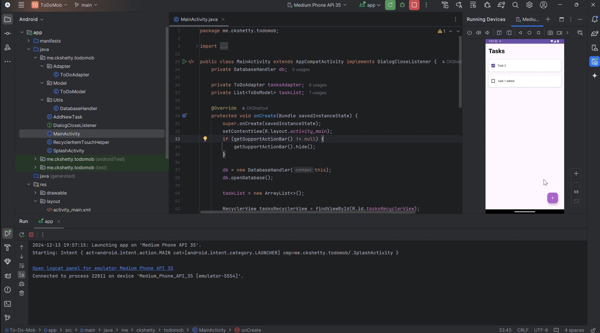
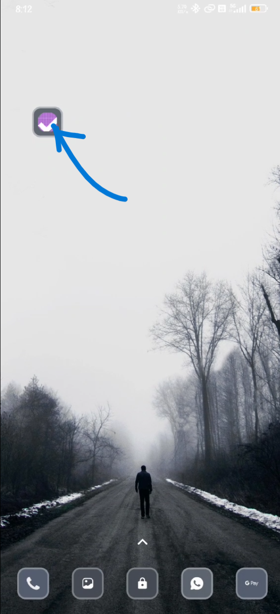

# To-Do Mob

A minimalistic task management Android application designed to help you stay organized. With a simple interface, the app allows you to **add**, **edit**, **view**, and **delete** tasks effortlessly.

---
## 📹 Demo

### Emulator Demo  
[](Demo/Emulator.mp4)

### Android Device Demo  
[](Demo/Android.mp4)

Click on the thumbnails above to watch the respective demo videos.

---

## 📥 Download

You can find the latest release of the application in the [Releases](https://github.com/CKShetty4/To-Do-Mob/releases) section of this repository.

---

## ⚙️ Tech Stack

- **IDE**: Android Studio 2024.1.1  
- **Language**: Java  
- **Build Tool**: Gradle (Groovy DSL)

---

## 📜 License

This project is licensed under the [MIT License](https://opensource.org/licenses/MIT).  

---

## 🚀 Features

- Add tasks to stay organized.
- Edit existing tasks as needed by swiping Right.
- View all your tasks in a simple, intuitive interface.
- Delete tasks you no longer need by swiping left.

---

## 🛠️ Installation

1. Clone this repository:  
   ```bash
   git clone https://github.com/CKShetty4/To-Do-Mob.git
   ```
2. Open the project in Android Studio.
3. Sync Gradle files.
4. Build and run the application on an emulator or physical Android device.

---

## 👤 Author

**C. K. Shetty**  
GitHub: [@CKShetty4](https://github.com/CKShetty4)


## ☕ Support Me

If you find this project helpful, consider buying me a coffee!  

[](https://www.buymeacoffee.com/CKShetty)

